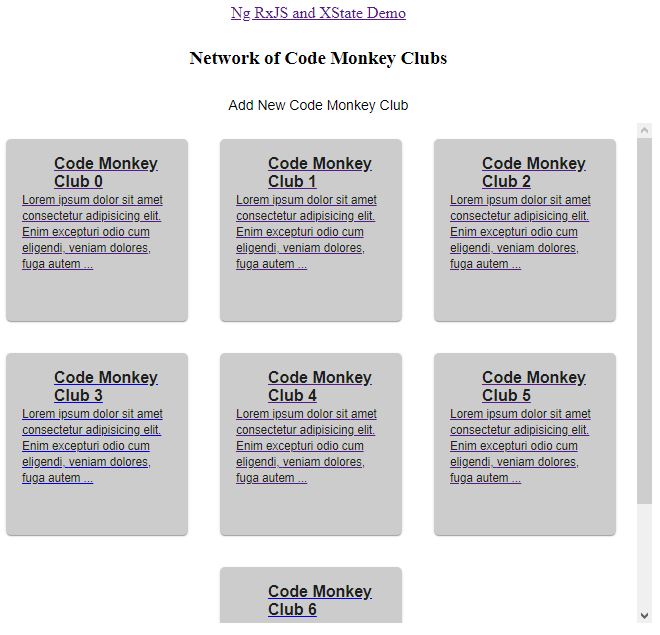
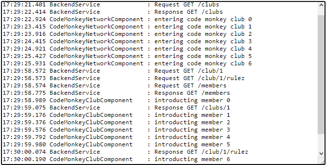

# Ng RxJS and XState Demo

This project was generated with [Angular CLI](https://github.com/angular/angular-cli) version 10.1.2.

## Install

Run `npm install`.

## Development server

Run `ng serve` for a dev server. Navigate to `http://localhost:4200/`. The app will automatically reload if you change any of the source files.

# Abstract

- [ReactiveX](http://reactivex.io)
- [RxJS](https://rxjs.dev/guide/overview)
- [XState](https://xstate.js.org)

# RxJS

## What is Reactive Programming?

> ...In computing, reactive programming is a declarative programming paradigm concerned with data streams and the propagation of change. With this paradigm it is possible to express static (e.g., arrays) or dynamic (e.g., event emitters) data streams with ease, and also communicate that an inferred dependency within the associated execution model exists, which facilitates the automatic propagation of the changed data flow.[citation needed]
>
> For example, in an imperative programming setting, **a:= b + c** would mean that **a** is being assigned the result of **b + c** in the instant the expression is evaluated, and later, the values of **b** and **c** can be changed with no effect on the value of **a**. On the other hand, in reactive programming, the value of **a** is automatically updated whenever the values of **b** or **c** change, without the program having to re-execute the statement **a:= b + c** to determine the presently assigned value of **a**.

-- source: [Wikipedia: reactive programming](https://en.wikipedia.org/wiki/Reactive_programming)


## Example: a = b + c

### Imperative Programming

In imperative programming it is quite simple. A sum is the (instant!) value of a and b.

``` typescript
  // variables representing values
  let a = 1;
  let b = 2;

  // value of expression (a + b) is instantly assigned to sum
  let sum = a + b; // 3
  console.log('sum', sum);

  // assigning a new value has no effect on sum
  a = 2;
  b = 2;
  console.log('sum', sum); // 3, unchanged

  // incase a or b is updated, sum needs to be re-assigned with new values in a and b
  sum = a + b;
  console.log('sum', sum); // 4, re-evaluated expression
```

In the abvoe example it shows once the sum is assigned, assigning a new value to a or b has now effect on the sum itself. In case sum needs to be updated, the expression needs to be re-evaluated.

### Imperative Vs Reactive Programming

In reactive programming streams are respresented by one core type in RxJS: [Observable](https://rxjs.dev/guide/observable).

Operations on an Observable can be done through [pipe operators](https://rxjs.dev/guide/operators) like map, merge, catchError, etc.

A [Subject](https://rxjs.dev/guide/subject) is a special type of Observable allowing multicasting.

``` typescript
  // variables representing streams, values are handled via streams
  // a stream in RxJS is represented by an Observable
  const a$: Subject<number> = new Subject<number>();
  // Subject is a special type of Observable allowing multicast to many Observers (=subscribers)
  const b$: Subject<number> = new Subject<number>();

  // combine both streams a$ and b$ to one stream
  const ab$: Observable<number[]> = combineLatest([a$, b$]);
  const sum$: Observable<number> = ab$
    // a pipe allows chaining
    .pipe(
      // map operator
      map(([aValue, bValue]) => aValue + bValue)
    );

  sum$.subscribe((total) => console.log('sum from stream', total)); // subscribe on streams a$ and b$
  a$.next(1); // pass value to a$ stream, ab$ stream is not notified yet

  // ab$ gets notified in case all observables has at least one value casted
  b$.next(2); // ab$: [1,2] => 3 is logged
  a$.next(2); // ab$: [2,2] => 4 is logged
  b$.next(3); // ab$: [2,3] => 5 is logged
```

## What is RxJS?

> The Observer pattern done right
>
> ReactiveX is a combination of the best ideas from the [Observer pattern](https://en.wikipedia.org/wiki/Observer_pattern), the [Iterator pattern](https://en.wikipedia.org/wiki/Iterator_pattern), and [functional programming](http://martinfowler.com/articles/collection-pipeline/#NestedOperatorExpressions)

-- source: [ReactiveX](http://reactivex.io)

ReactiveX (Reactive Extensions) especially enhances reactive programming with possibilities to combine and transform streams using query-like operators.

> RxJS is a library for composing asynchronous and event-based programs by using observable sequences. It provides one core type, the Observable, satellite types (Observer, Schedulers, Subjects) and operators inspired by Array#extras (map, filter, reduce, every, etc) to allow handling asynchronous events as collections.

-- source: [RxJS - Introduction](https://rxjs.dev/guide/overview)

RxJS is a JavaScript implementation of [ReactiveX (Reactive extensions)](http://reactivex.io).

### Observer Pattern

The [Observer pattern](https://en.wikipedia.org/wiki/Observer_pattern) is used for data streams and data propagation. An object, called Subject, maintaining a list dependents, called Observers, that gets notified.

UML class diagram of Observer pattern.


A sample UML class and sequence diagram for the Observer design pattern.


### Iterator Pattern

The [Iterator pattern](https://en.wikipedia.org/wiki/Iterator_pattern) loops through a stream of data (Iterable.next()) and may complete (Iterable.complete()) or may throw an error (Iterable.error()).

UML class diagram of Iterator pattern.


A sample UML class and sequence diagram for the Iterator design pattern.


### ReactiveX - Differences and What it is not

- a paradigm that goes beyond the Observer pattern allowing to subscribe on, transform, combine data streams and even control the threading of the streams - [StackOverflow](https://stackoverflow.com/a/16652921).
- an [Observable differs from a Promise](https://angular.io/guide/comparing-observables#observables-compared-to-promises), since it…
  - … is declarative and starts on subscriptions
  - … provide many values
  - … allows chaining/piping of operations

# Demo application

This app introduces you to all the Code Monkeys in the world. The app shows you:

- A network of all Code Monkey clubs.
- New clubs are incubating in various places and countries.
- Each club holds a number of loosely connected members.
- Each member follows strictly the Code Monkey rulez.

There are two views: Network View of Code Monkey Clubs and Detail View of a Code Monkey Club

## Network View of Code Monkey Clubs



## Detail View of a Code Monkey Club


## Status Bar



All actions like code fights or backend calls are logging into a status bar shown in the footer.

The following sections provide RxJS and XState examples in this demo app.

# RxJS log service example: Sharing Data through Streams

One common usage is sharing data between components. Especially data changing constantly through time are perfect candidates for using streams.

RxJS' [Subject](https://rxjs.dev/guide/subject) is special type of an [Observable](https://rxjs.dev/guide/observable):

- Sending data: [Subject.next(value?: T)](https://rxjs.dev/api/index/class/Subject#next-) allows a component to send data.
- Receiving data: [Object.subscribe()](https://rxjs.dev/api/index/class/Observable#subscribe-) allows a component to receive data.

### Log Service
Here is a log service allowing a producer (component) sending and a consumer (component) receiving logs:

```typescript
export class LogService {
  ...
  private logs$ = new Subject<string>();
  ...
  log(source: string, ...args: any[]): void {
    ...
    // concat arguments into one log message
    const logMessage = args.reduce((last, current) => {
      ...
    }, ':');
    ...
    // multicast logs to Subject
    this.logs$.next(this.logs);
  }

  getLogs(): Observable<string> {
    return this.logs$;
  }
}
```

### Producers: CodeMonkeyNetworkComponent and CodeMonkeyClubComponent

The network and code monkey components are sending logs:

```typescript
export class CodeMonkeyNetworkComponent implements OnInit {
  ...
  loadData(): void {
    this.backendService.getClubs().subscribe(
      // next data subscriber
      (clubs) => {
        this.clubs = [];
        clubs.forEach((club, index) => {
          setTimeout(() => {
            // log incoming data
            this.logService.log(
              'CodeMonkeyNetworkComponent',
              'Adding to network: ',
              club.id
            );
            this.clubs.push(club);
          }, index * 500 + 500);
        });
      },
      // error subscriber
      (error) => {
        // log incoming error
        this.logService.log('CodeMonkeyClubComponent', error);
      }
    );
  }
  ...
}
```

```typescript
export class CodeMonkeyClubComponent implements OnInit {
  ...
  loadData(): void {
    // get club details
    const id = Number.parseInt(this.route.snapshot.paramMap.get('id'), 10);
    this.backendService.getClubById(id).subscribe(
      // next data subscriber
      (club) => {
        // log incoming data
        this.logService.log(
          'CodeMonkeyClubComponent',
          'showing details for code monkey club',
          club.id
        );
        this.club = club;
      },
      // error subscriber
      (error) => {
        // log incoming error
        this.logService.log('CodeMonkeyClubComponent', error);
      }
    );

    // get rulez
    this.backendService.getClubRulez(id).subscribe(
      ...
    );

    // get members
    this.backendService.getMembers().subscribe(
      ...
    );
  }
  ...
}
```

### Consumer: StatusBarComponent

The status bar component get a messages Observable (resp. Subject) from the log service:

```typescript
export class StatusBarComponent implements OnInit {
  // NOTE: subscribe is done in template using async pipe
  logs$: Observable<string>;

  constructor(private logService: LogService) {}

  ngOnInit(): void {
    // get logs for displaying in status bar template
    this.logs$ = this.logService.getLogs().pipe(
      // tap: a pipe operator that 'peaks' for incoming data
      // this is useful e.g. for side effects
      tap(() => {
        // auto scroll textarea to bottom
        this.scrollToBottom();
      }),
    );
  }

  private scrollToBottom(): void {
    setTimeout(() => {
      const textarea = document.getElementById('status-bar');
      textarea.scrollTop = textarea.scrollHeight;
    }, 50);
  }
}
```

Please note that the component itself holds only the Observable but does not subscribe to it. This is done in the template:

```html
<!-- Subsribe logs$ using async -->
<textarea id="status-bar" class="status-bar" fxFlex="grow">{{ logs$ | async}}</textarea>
```

Another way is subscribing the Observable instead of using async:

```typescript
export class StatusBarComponent implements OnInit {

  logs: string;
  ...
  ngOnInit(): void {
    // get logs for displaying in status bar template
    this.logService.getLogs().pipe(
      // tap: a pipe operator that 'peaks' for incoming data
      // this is useful e.g. for side effects
      tap(() => {
        // auto scroll textarea to bottom
        this.scrollToBottom();
      }),
    )
    // subscribe and update logs
    .subscribe(messages => this.statusMessages = messages);
  }
  ...
}

```

```html
<textarea id="status-bar" class="status-bar" fxFlex="grow">{{ logs }}</textarea>
```

# XState

Simplifying UI-Workflows by modelling finite state machines. In software design a UI workflow is described in linear transitions and all possible results. Doing the same in software development 'as-is' is horror and leads to complex implementations. Using FSMs (https://en.wikipedia.org/wiki/Finite-state_machine), in defining states and inputs, make code way simpler and easier to maintain.

# Resources
- [RxJS](https://rxjs.dev/guide/overview)
- [ReactiveX](http://reactivex.io)
- [XState](https://xstate.js.org)
